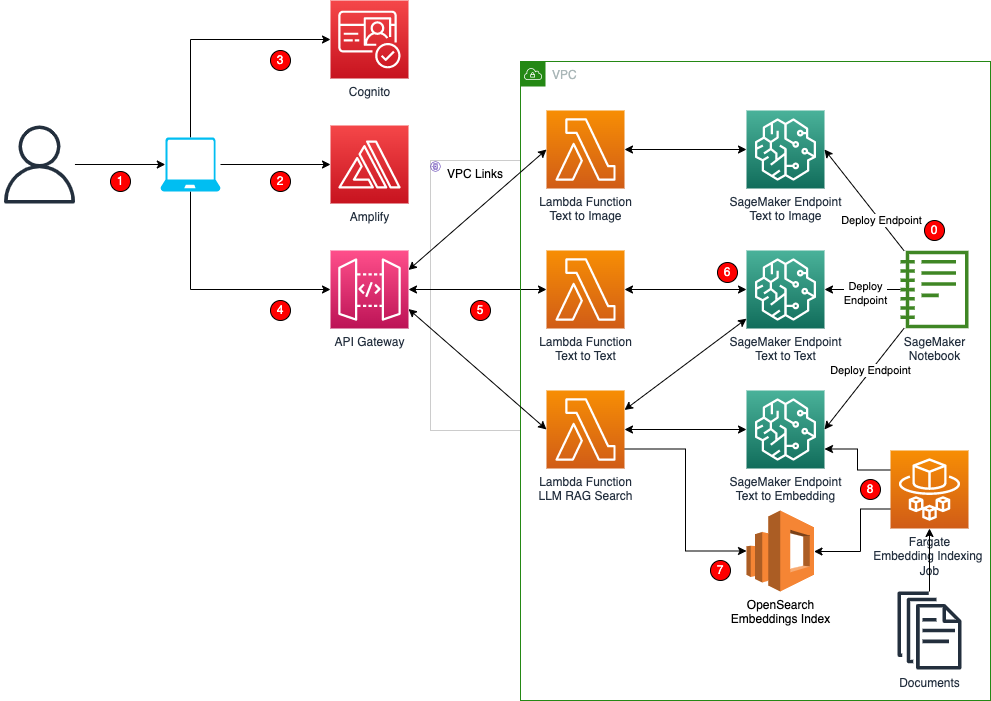

# Generative AI Amplify React Demo App!

This is a sample Generative AI Full stack project. In this project we show you how you can take a SageMaker Generative AI model, expose it as a SageMaker Endpoint and consume the Foundational Model in a React Amplify front end. This sample project also demonstrates an implementation of Retrieval Augmented Generation using AWS OpenSearch. The project illustrates how to take sample documents and use a SageMaker Endpoint running an Embeddings LLM to get the embeddings and create an embeddings index within OpenSearch. The app integrates with Cognito for authentication. All the backend components including Lambda, SageMaker Endpoints, OpenSearch, Fargate all run within a VPC.

**This project is intended for educational purposes only and not for production use.**

 This is the top level menu of the application allowing navigating to different examples:
Generate Text Menu - This page allows using various Text to Text prompting using Flan-T5 XL Model
Generate Image Menu - This page allows using Text prompts to generate images using StabilityAI Stable Diffusion v2-1 Base Model
Legal Docs Q&A - This pages uses a Retrieval Augmented Generation approach to search context from OpenSearch and answer the Question using Flan-T5 XL Model

## Solution Architecture
This CDK project deploys the below architecture:


Details of the architecture are as follows:
1. User access the React Application from their browsers on their computer
2. Amazon Amplify is hosting the React Application
3. The application is leveraging Amazon Cognito for Authentication. Unauthenticated users accessing the application are redirected to Login page for authentication.
4. API Gateway exposes the LLM Models to the React Amplify Application. The API Gateway leverages Lambda API Authorizer to validate the Bearer Token (secured from Cognito Authentication) to ensure authenticated users are accessing the application. API Gateway interacts with backend via VPC Links.
5. Orchestration and Business Logic is implemented as Amazon Lambda Python code. Lambda functions invoke the SageMaker Endpoints and reformat the response before sending back. Lambda functions also orchestrate OpenSearch API's and SageMaker Endpoints for the Legal Docs Q&A. Lambda Functions run within the VPC Private Subnets.
6. Amazon SageMaker Endpoints expose the models as API within the VPC. These SageMaker Endpoints are created from Amazon SageMaker JumpStart Models.
7. Amazon OpenSearch has KNN based index created using Text Embeddings for the documents. These embeddings are matched with embeddings for the context provided by the user to be used as context for the Text to Text LLM's.
8. Fargate Embedding Indexing Jobs are Fargate jobs which take documents create Text Embedding using SageMaker Text to Embeddings JumpStart based endpoints and index the embeddings within OpenSearch.

## Steps to setup this solution within your AWS Account
1. Clone this git repo to your computer
2. Navigate to the root folder: secured-appgenai-sample-cdk
3. This project is a Python Project. Switch to the Virtual Env using the below
```
$ python3 -m venv .venv
```

After the init process completes and the virtualenv is created, you can use the following
step to activate your virtualenv.

```
$ source .venv/bin/activate
```

If you are a Windows platform, you would activate the virtualenv like this:

```
% .venv\Scripts\activate.bat
```
4. Install the required dependencies:
```
$ pip install -r requirements.txt
```
5. Initialize CDK within the project using
```
$ cdk init
```
6. Bootstrap the CDK environment
```
$ cdk bootstrap
```
7. Deploy the Backend Components running the following command:
```
$ cdk deploy GenAIAmplifyAppAPILambdaStack -O amplify/src/cdk-exports.json
```
This command deploys all the stacks including SecureGenAIAppVpcStack, GenerativeAITxt2TxtStack, GenerativeAITxt2ImgStack, GenerativeAITxt2EmbStack, OpenSearchEmbeddingDomainStack and Docs2EmbeddingsOSIndexingStack
8. Navigate to the amplify folder using
```
$ cd amplify
```
9. Initialize Amplify by running, accept defaults in the prompts and proceed.
```
$ amplify init
```
10. Add Amplify Hosting by running
```
$ amplify hosting add
```
11. Publish the App to Amplify by running and note down the URL to the deployed application:
```
$ amplify publish
```
12. The Cognito deployed within the AWS Account needs a user to be added. Once added navigate to the application using the URL from previous step.


The `cdk.json` file tells the CDK Toolkit how to execute your app.

This project is set up like a standard Python project.  The initialization
process also creates a virtualenv within this project, stored under the `.venv`
directory.  To create the virtualenv it assumes that there is a `python3`
(or `python` for Windows) executable in your path with access to the `venv`
package. If for any reason the automatic creation of the virtualenv fails,
you can create the virtualenv manually.

To add additional dependencies, for example other CDK libraries, just add
them to your `setup.py` file and rerun the `pip install -r requirements.txt`
command.

## Useful commands

 * `cdk ls`          list all stacks in the app
 * `cdk synth`       emits the synthesized CloudFormation template
 * `cdk deploy`      deploy this stack to your default AWS account/region
 * `cdk diff`        compare deployed stack with current state
 * `cdk docs`        open CDK documentation

Enjoy!
